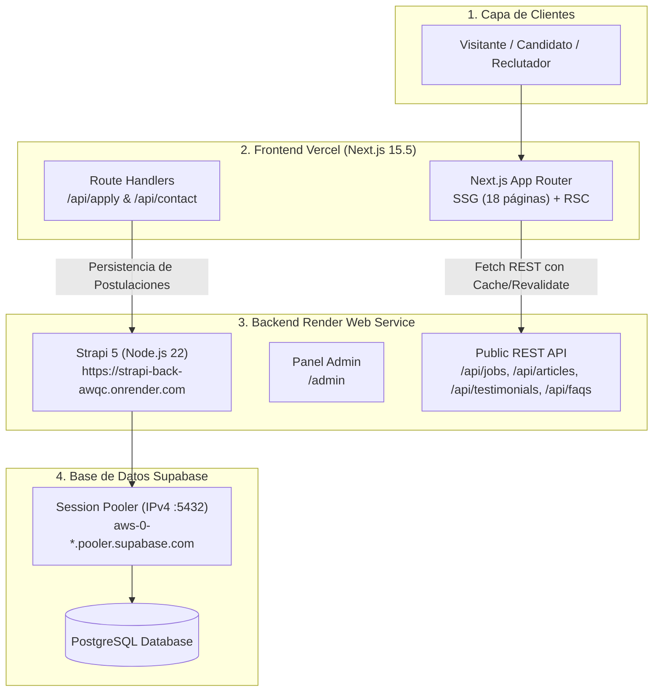

# 🚀 Guía de Despliegue y Operación en Producción

Documento operativo para el lanzamiento y mantenimiento de la plataforma de reclutamiento:
- **Backend Headless CMS**: Strapi 5 en Render Web Service.
- **Base de Datos**: PostgreSQL en Supabase (Session Pooler IPv4).
- **Frontend Web**: Next.js 15.5 App Router en Vercel.

---

## 📌 1. Estado y Topología Actual del Sistema



### URLs y Referencias del Entorno
- **Strapi Backend en Vivo**: `https://strapi-back-awqc.onrender.com`
- **Strapi Panel de Control**: `https://strapi-back-awqc.onrender.com/admin`
- **Repositorio Backend**: `https://github.com/Carlosvalderrama93/strapi_folder` (rama: `develop`)
- **Repositorio Frontend**: `https://github.com/Carlosvalderrama93/next_folder` (rama: `develop`)

---

## 📦 2. Paso 1: Sembrado de Contenido Inicial en Strapi

Tu instancia de Strapi ya está conectada a la base de datos PostgreSQL, pero las colecciones están vacías (`total: 0`).

### Ejecución desde Render Shell
1. Ingresa a [Render Dashboard](https://dashboard.render.com).
2. Abre tu servicio **`strapi-back-awqc`**.
3. En la esquina superior derecha, haz clic en la pestaña **Shell**.
4. Ejecuta el script de siembra:
   ```bash
   npm run seed
   ```
5. Publica todo el contenido y asegura los permisos públicos:
   ```bash
   npm run publish:all
   ```

### ¿Qué realiza este procedimiento automáticamente?
- Inserta **20 ofertas de empleo** estructuradas (con modalidad, salario, skills y estado activo).
- Inserta **20 artículos de blog** especializados en reclutamiento IT y carrera profesional.
- Inserta **6 testimonios** de clientes y candidatos.
- Inserta **5 preguntas frecuentes (FAQs)**.
- Publica todas las entradas (`draft` ➔ `published`).
- Configura los permisos del rol **Public** (`find` y `findOne` para lectura pública, y `create` para postulaciones y mensajes de contacto).

---

## 👤 3. Paso 2: Creación de la Cuenta Super Admin

1. Abre en tu navegador:
   ```text
   https://strapi-back-awqc.onrender.com/admin
   ```
2. Completa el formulario de primer acceso:
   - **First name / Last name**: Tu nombre.
   - **Email**: Tu correo administrativo.
   - **Password**: Contraseña segura (mínimo 8 caracteres, mayúscula, minúscula y número).
3. Haz clic en **Let's start**. Desde este panel podrás gestionar vacantes, revisar candidatos postulados y editar artículos en tiempo real.

---

## ⚡ 4. Paso 3: Despliegue del Frontend en Vercel

### A. Subir los últimos ajustes de Next.js
En tu terminal local, confirma que la rama `develop` esté al día en GitHub:
```bash
cd /home/charlie/Documents/Development/RecruiterProjects/recruiter_Page/next_folder
git push origin develop
```

### B. Crear el Proyecto en Vercel
1. Ingresa a [Vercel](https://vercel.com/new) con tu cuenta de GitHub.
2. Selecciona **Add New...** ➔ **Project**.
3. Importa el repositorio **`Carlosvalderrama93/next_folder`**.
4. Configuración del proyecto:
   - **Project Name**: `recruiter-page` (o el de tu preferencia).
   - **Framework Preset**: `Next.js`.
   - **Root Directory**: `./` (directorio raíz).
   - **Build Command**: `npm run build` (por defecto).
   - **Output Directory**: `.next` (por defecto).

### C. Variables de Entorno en Vercel
En la sección **Environment Variables**, añade las siguientes claves:

| Variable | ¿Es Obligatoria? | Valor Recomendado | Propósito |
|---|---|---|---|
| `NEXT_PUBLIC_STRAPI_URL` | **Sí** | `https://strapi-back-awqc.onrender.com` | URL de Strapi accesible desde el navegador del cliente |
| `STRAPI_URL` | **Sí** | `https://strapi-back-awqc.onrender.com` | URL de Strapi consumida por Next.js en servidor (SSR/SSG) |
| `NEXT_PUBLIC_SITE_URL` | Recomendada | `https://tudominio.com` *(o la URL de Vercel)* | Metadatos canónicos, OpenGraph y Sitemap |
| `RESEND_API_KEY` | Opcional | `re_xxxxxxxxxxxx` | Envío de emails con CVs adjuntos (ver detalle abajo) |
| `CONTACT_EMAIL` | Opcional | `tu-email@gmail.com` | Correo donde tú recibes las postulaciones de candidatos |
| `RESEND_FROM` | Opcional | `onboarding@resend.dev` | Remitente verificado de los correos transaccionales |

---

### 📧 D. ¿Qué es `RESEND_API_KEY` y cómo configurarlo?

[Resend](https://resend.com) es una plataforma de **emails transaccionales** de alta entregabilidad. En este proyecto se utiliza para que, cada vez que un candidato postule a una vacante o alguien use el formulario de contacto:
1. El candidato y su información queden registrados en Strapi (`/api/applications`).
2. Recibas un **correo instantáneo en tu buzón personal** con los datos del candidato y su **CV (PDF) adjunto**.

> [!NOTE]
> **¿Es obligatorio para desplegar hoy?**
> **No.** El código cuenta con un *Graceful Fallback*: si no configuras `RESEND_API_KEY`, la postulación **se guarda exitosamente en Strapi** y la notificación se registra en los logs del servidor sin arrojar errores ni bloquear al candidato.

#### Paso a paso para activarlo (100% Gratuito - 3,000 emails/mes):
1. Entra a [resend.com](https://resend.com) y crea una cuenta gratuita con tu GitHub o correo.
2. En el menú lateral izquierdo, haz clic en **API Keys**.
3. Haz clic en **Create API Key**:
   - **Name**: `Recruiter Production`
   - **Permission**: `Full access` o `Sending access`
4. Copia la clave generada (empieza por `re_...`).
5. En Vercel (o en tu archivo `.env.local`):
   - `RESEND_API_KEY`: Pega tu clave (`re_...`).
   - `CONTACT_EMAIL`: Pon el email donde deseas recibir las alertas (ej. `tu-correo@outlook.com`).
   - `RESEND_FROM`: Puedes dejar `onboarding@resend.dev` (el remitente de pruebas de Resend).
     *(Nota: En modo sandbox con `onboarding@resend.dev`, Resend permite enviar correos únicamente a la dirección con la que te registraste en Resend).*
6. *(Opcional para el futuro)*: Si quieres enviar desde tu propio dominio (ej. `carlos@midominio.com`), en Resend vas a **Domains** ➔ **Add Domain** y agregas los registros DNS que te indique.

---

### E. Despliegue en Vercel
1. Haz clic en **Deploy**.
2. Vercel compilará la aplicación en ~60 segundos y te asignará una URL en vivo (ejemplo: `https://recruiter-page-xxx.vercel.app`).

---

## 🔍 5. Paso 4: Verificación y Pruebas de Humo (Smoke Testing)

Una vez completado el despliegue en Vercel:

| Prueba | URL a Comprobar | Resultado Esperado |
|---|---|---|
| **Página Principal** | `https://tu-app.vercel.app/es` | Carga de banner, testimonios y secciones sin errores de hidratación. |
| **Bolsa de Empleos** | `https://tu-app.vercel.app/es/jobs` | Visualización de las 20 vacantes servidas desde Strapi. |
| **Filtros de Búsqueda** | `https://tu-app.vercel.app/es/jobs?search=react` | Filtrado instantáneo por texto, modalidad y tags. |
| **Detalle de Vacante** | `https://tu-app.vercel.app/es/jobs/:id` | Descripción completa, requisitos y botón de postulación. |
| **Formulario de Postulación** | Modal en `/jobs/:id` | Envío exitoso guardado en `/api/applications` de Strapi. |
| **Artículos de Blog** | `https://tu-app.vercel.app/es/articles` | Listado de 20 publicaciones técnicas con SSG. |
| **Formulario de Contacto** | `https://tu-app.vercel.app/es/contact` | Mensaje registrado en `/api/inquiries` de Strapi. |
| **SEO y Sitemaps** | `https://tu-app.vercel.app/sitemap.xml` | XML generado con todas las rutas y locales `/es` y `/en`. |

---

## 🌐 6. Paso 5: Conexión de Dominio Propio (Opcional)

Si dispones de un dominio (ejemplo: `midominio.com`):

### En Vercel (Frontend Principal)
1. Ve a **Settings** ➔ **Domains** en tu proyecto de Vercel.
2. Añade `midominio.com` y `www.midominio.com`.
3. En tu proveedor DNS (Cloudflare, GoDaddy, Namecheap):
   - Registro `A` apuntando a `76.76.21.21`
   - Registro `CNAME` para `www` apuntando a `cname.vercel-dns.com`

### En Render (Subdominio de Strapi)
1. En Render > tu Web Service > **Settings** > **Custom Domains**.
2. Añade `api.midominio.com`.
3. En tu proveedor DNS añade un registro `CNAME`:
   - `api` apuntando a `strapi-back-awqc.onrender.com`.

---

## 🛠️ 7. Guía de Mantenimiento y Troubleshooting

### A. Comportamiento "Cold Start" en el Plan Gratuito de Render
> [!NOTE]
> En el plan Free de Render, la instancia se suspende tras 15 minutos de inactividad. La primera petición tras la suspensión puede demorar ~40-50 segundos en despertar. Una vez activa, responde a velocidad normal. Para producción comercial continua se recomienda el plan **Starter ($7/mes)** que mantiene el servidor 100% despierto.

### B. Supabase Connection Pooling (IPv4 vs IPv6)
> [!IMPORTANT]
> Render opera sobre red IPv4. Siempre mantén en `DATABASE_URL` la conexión con el host **`pooler.supabase.com`** en el puerto `5432` (Session Pooler). Nunca uses la conexión directa (`db.xxxx.supabase.co`) ya que es IPv6-only y provocará error `ENETUNREACH`.

### C. Regeneración o Reinicio de Datos
Si en el futuro deseas reiniciar los datos de prueba:
```bash
# Desde el Shell de Render
npm run seed
npm run publish:all
```
